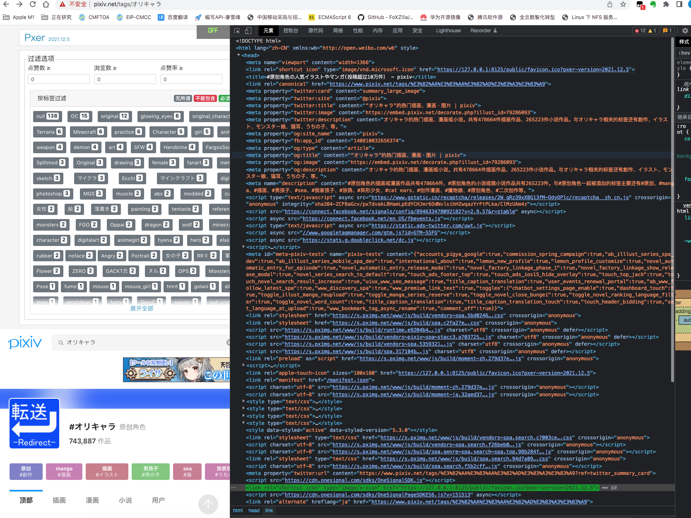
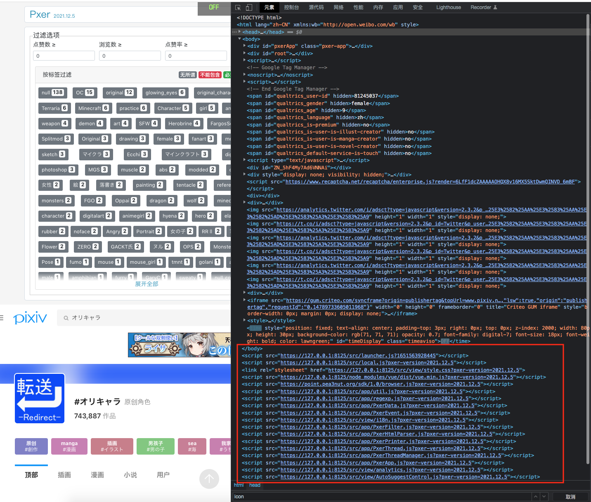

# Pxer入口加载-launcher.js的代码分析




``` js
// 设置全局变量 window.pxer，注意区别于保存环境配置的全局变量 window.PXER
window['pxer'] = window['pxer'] || {};

// pxer.util 存储几个重要的公共方法
pxer.util = pxer.util || {};

// pxer.util.afterLoad = 设置DOM加载定时器
pxer.util.afterLoad =function(fn){
    if(document.readyState !== 'loading'){
        setTimeout(fn);
    }else{
        document.addEventListener('DOMContentLoaded', fn);
    }
};

/* 
pxer.util.compile = 输入一段代码，将嵌套的变量{{ xxx }}替换为真实值并输出
    正则表达式：/{{\s*([\w_]+)\s*}}/，意思是，其中：\s*：0个或多个空格；([\w_]+)：至少一个标识符，允许字母或_
    输入：pxer.util.compile("a = {{ origin }}")
    输出：'a = https://www.pixiv.net'
    注意：([\w_]+) 要求标识符不应包含'.'，所以不支持替换多级变量？
*/
pxer.util.compile = function (str, scope = window) {
    let matchResult = null;
    while (matchResult = str.match(/{{\s*([\w_]+)\s*}}/)) {
        str = str.replace(matchResult[0], scope[matchResult[1]]);
    }
    return str;
};

/*
pxer.util.set = 将一个变量[k,v]存入obj
    输入变量可能有多层结构（例如：packge.scripts.dev），为此需要逐层解析以防止中间有一节断掉了
*/
pxer.util.set = function (obj, key, val) {
    const keys = key.split('.');
    let pointer = obj;
    for (let i = 0; i < keys.length; i++) {
        if (i === keys.length - 1) {
            pointer[keys[i]] = val;
        } else {
            pointer[keys[i]] = pointer[keys[i]] || {};
            pointer = pointer[keys[i]];
        }
    }
};

// pxer.util.get = 读取某个变量。注意其采取递归方法可以遍历结构对象
// @ref https://www.jianshu.com/p/162dad820f48
pxer.util.get = function self(data,f){
    if(f.substr) f = f.split(/\.|\\|\//);

    if(f.length && data){
        return self(data[f.shift()],f)
    }else if(!f.length && data){
        return data
    }else {
        return "";
    }
};

/*
pxer.util.addFile = 根据文件列表类型，拼接js代码或DOM组件
    - js：<body>中追加一个<script>组件，<script src="https://127.0.0.1:8125/src/local.js?pxer-version=2021.12.5"></script>
    - css：<body>追加一个<link>组件，<link rel="stylesheet" href="https://127.0.0.1:8125/src/view/style.css?pxer-version=2021.12.5">
    - icon：<head>追加一个<link>组件，<link rel="shortcut icon" type="image/vnd.microsoft.icon" href="https://127.0.0.1:8125/public/favicon.ico?pxer-version=2021.12.5">
    - json：读取json文本，直接输出json变量结构
    - text：读取文本文件，直接输出文本信息
*/
pxer.util.addFile = async function (url) {
    const sector = url.includes('?') ? '&' : '?';

    // 根据/*@auto-fill*/注释信息，为build时替换版本信息
    const pxerVersion = /*@auto-fill*/'2021.12.5'/*@auto-fill*/;

    // 如果url不是http或https开头的完整地址，则从pxer.url补足url信息，并在尾部追加版本信息
    // 最终结果类似：https://127.0.0.1:8125/src/launcher.js?1651563928445
    if (!/^(https?:)?\/\//.test(url)) url = pxer.url + url;
    url = url + sector + `pxer-version=${pxerVersion}`;

    const createScript = () => new Promise(function (resolve, reject) {
        const elt = document.createElement('script');
        elt.addEventListener('error', reject);
        elt.addEventListener('load', resolve);
        elt.addEventListener('load', () => pxer.log('Loaded ' + url));
        elt.src = url;
        document.documentElement.appendChild(elt);
        return elt;
    });
    const createCss = () => new Promise(function (resolve) {
        const elt = document.createElement('link');
        elt.rel = 'stylesheet';
        elt.href = url;
        document.documentElement.appendChild(elt);
        resolve();
    });
    const createIcon = () => new Promise(function (resolve) {
        pxer.util.afterLoad(() => {
            Array.from(document.querySelectorAll("link[rel*='icon']")).forEach(elt => elt.href = url);
        });
        (document.head || document.documentElement).appendChild(function(){
            const elt = document.createElement('link');
            elt.rel = 'shortcut icon';
            elt.type = 'image/x-icon';
            elt.href = url;
            return elt;
        }());
        resolve();
    });

    // 取出url地址的文件名后缀
    const fileFormat = url.match(/\.([^.]+?)(\?.+?)?$/)[1];
    switch (fileFormat) {
        case 'js':
            return createScript();
        case 'css':
            return createCss();
        case 'ico':
            return createIcon();
        case 'json':
            return fetch(url).then(res => res.json());
        default:
            return fetch(url).then(res => res.text());
    }
};

// 前面是设置变量和定义方法，这里开始执行main，主要任务就是动态加载主应用代码
(async function(){
    // PXER_MODE有三种模式：native、local、sfp
    window['PXER_URL'] = window['PXER_URL'] || 'https://pxer-app.pea3nut.org/';
    window['PXER_MODE'] = window['PXER_MODE'] || 'native';
    window['PXER_LANG'] = window['PXER_LANG'] || (document.documentElement.lang || window.navigator.language).split('-')[0];

    pxer.url = PXER_URL;
    pxer.mode = PXER_MODE;
    pxer.lang = PXER_LANG;
    pxer.log = (...msg) => console.log('[Pxer]', ...msg);

    switch (PXER_MODE) {
        case 'dev':
        case 'master':
            // old version doesn't declare "@require vuejs"
            await pxer.util.addFile('https://cdn.jsdelivr.net/npm/vue@2.6/dist/vue.min.js');
        case 'native':
            // 从公网拉取native.js
            await pxer.util.addFile('native.js');
            break;
        case 'local':
            // 从本机拉取src/local.js
            await pxer.util.addFile('src/local.js');
            break;
        case 'sfp':
            break;
    }
})().catch(console.error);
```
