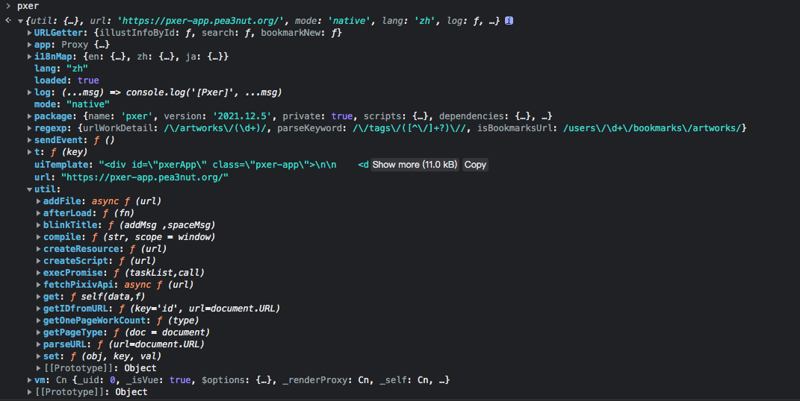

# Pxer的技术分析报告

## PXER的运行模式

根据`/types.d.ts`中对变量`PXER_MODE`的定义，PXER有三种运行模式：

dev 和 master 都是 native 的别名。

### native模式

- 从公网进行下载安装，地址位于：[https://pxer-app.pea3nut.org/](https://pxer-app.pea3nut.org/)
- 浏览器打开`pxer.user.js`，TM自动安装Pxer插件
- TM插件安装成功后，打开目标网站[https://www.pixiv.net/](https://www.pixiv.net/)，将在顶部看到TM插件的控制界面
- 此时，Pxer的核心应用代码位于：`/dist/native.js`


### local模式

- 下载源码后运行`npm run dev`，本地启动一个http server，地址是[http://localhost:8125](http://localhost:8125)，内容就是源码目录
- 浏览器打开`pxer.user.js`，TM自动安装Pxer插件
- TM插件安装成功后，打开目标网站[https://www.pixiv.net/](https://www.pixiv.net/)，将在顶部看到TM插件的控制界面
- 此时，Pxer的核心应用代码位于：`/src/local.js`，主要功能是根据`/src/files.json`的文件列表将代码片段组装到DOM

### sfp模式

- sfp模式用于批量下载图片文件
- 安装方式是选择`sfp.user.js`，则TM自动识别并安装Pxer批量下载插件
- 此时，Pxer的核心应用代码位于：`/dist/sfp.user.js`，其内容是：TM插件 + native.js，也就是将APP应用代码直接纳入TM插件之中。

## 目录结构和导入点

``` console
JiandeiMac:Pxer sj$ tree -F
Pxer
├── Dockerfile
├── LICENSE
├── README.md
├── README.zh.md
├── build/                      # build/：包含若干个脚本文件
│   ├── build-launcher.js       # 构造生成launcher.js
│   ├── build-native.js         # 构造生成native.js
│   ├── build-sfp.js            # 构造生成sfp.user.js
│   ├── native.ejs              # native.js的模版
│   ├── package-files.js        # 工具方法
│   └── sfp.ejs                 # sfp.user.js的模版
├── dist/                       # dist/：是build中脚本文件的输出结果，也是localhost:8125的文件体系
├── nginx.conf
├── package-lock.json
├── package.json                # 用于npm打包的配置文件
├── public/
│   ├── favicon.ico
│   ├── i18n/                   # 三种语言文字版本
│   │   ├── en.json
│   │   ├── ja.json
│   │   └── zh.json
│   ├── pxer-ui.gif
│   └── test-ui.html
├── push-tag-image.sh
├── src/                        # src/：源码文件，其中部分文件需要build
│   ├── app/
│   │   ├── PxerApp.js          # Pxer主程序对象，与所有模块都是强耦合关系
│   │   ├── PxerData.js
│   │   ├── PxerEvent.js
│   │   ├── PxerFilter.js
│   │   ├── PxerHtmlParser.js
│   │   ├── PxerPrinter.js
│   │   ├── PxerThread.js
│   │   ├── PxerThreadManager.js
│   │   ├── regexp.js
│   │   └── util.js
│   ├── files.json              # APP代码片段的文件列表信息
│   ├── launcher.js             # 根据PXER_MODE，分别加载native.js 或者 local.js
│   ├── local.js
│   ├── local.user.js           # 本地TamperMonkey的入口文件，任务就是一个，加载`src/launcher.js`
│   └── view/
│       ├── AutoSuggestControl.js
│       ├── analytics.js
│       ├── i18n.js
│       ├── style.scss          # scss定义文件，被node-sass调用生成style.css
│       ├── template.html       # UI的模版文件
│       └── vm.js
└── types.d.ts
```

根据其文档说明，在Clone其代码后，主要步骤是：

- `npm install`：安装npm依赖包
- `npm run dev`: 见下面详述

## 关于 npm build dev

``` yaml
    "dev": "npm run build && ws --https --port 8125 --cors.origin=*",
    "build": "node-sass src/ --output src/ && node build/build-launcher && node build/build-native && node build/build-sfp",
```

- `node-sass src/ --output src/`: 寻找src/目录下的sass文件，并编译为css文件
- `node build/build-launcher`: 根据模版文件，生成安装脚本`launcher.js`
- `node build/build-native`: 根据模版文件，生成App的主应用代码，来自于src/app和src/view等
- `node build/build-sfp`: sfp模式与native模式的代码基本相同，但将应用代码集成到TM插件之中
- `ws --https --port 8125 --cors.origin=*`: 打开websocket，结果就是启动了一个webserver，`https://localhost:8125`就是当前项目的目录信息

## dist/：存放构建后的js文件目录

运行Dockerfile，就是安装一个Nginx目录服务，其中：

- `/`：对应`dist/`，包含了5个脚本文件
- `public/`：对应`public/`，包含了图片文件、测试UI的Html文件、3种语言的文本信息

> 公网的安装地址位于：[https://pxer-app.pea3nut.org/](https://pxer-app.pea3nut.org/)，其目录内容也与此相同

``` console
../
public/                  05-Dec-2021 11:50       -
jsonp.js                 05-Dec-2021 11:50    3851
launcher.js              05-Dec-2021 11:50    3851    # 生成的入口加载代码，很短
native.js                05-Dec-2021 11:50    306K    # 生成的App主代码，包含css、函数等全部内容
pxer.user.js             05-Dec-2021 11:50    1403    # TamperMonkey的Pxer安装脚本，用于Pxer主应用
sfp.user.js              05-Dec-2021 11:50    311K    # TamperMonkey的SFP安装脚本，用于批量下载图片
```

## Pxer的加载顺序（Native模式）

### 1. `dist/pxer.user.js`：TamperMonkey的安装脚本

xxx.user.js的文件名被识别为TM脚本文件，TamperMoney将自动询问是否安装！
任务很简单，就是加载`https://pxer-app.pea3nut.org/launcher.js`，也就是`dist/launcher.js`这个入口执行代码。


> `dist/sfp.user.js`也类似，是批量下载工具sfp的TM安装入口

### 2. `dist/launcher.js`：Pxer的入口执行代码

- 构建方法

该文件的模版代码位于`src/launcher.js`，通过`node build/build-launcher`生成。
build脚本文件（`build/build-launcher.js`）的任务也很简单，就是将版本信息替换微当前的package.json中版本号。

> `const pxerVersion = /*@auto-fill*/'2021.12.5'/*@auto-fill*/;`

- 核心功能

该代码的核心逻辑包括：

- 设置全局变量 `window['pxer']`
- 定义`pxer.util`的5个基础方法：afterLoad、compile、set、get、addFile
- 将代码文件`https://pxer-app.pea3nut.org/native.js`追加到`pxer.util`。目的是构造App的各个功能模块，最终结构如下：



### 3. `dist/native.js`：Pxer的主应用代码

- 构建方法

build脚本文件（`build/build-native.js`）的任务就是生成`dist/native.js`。

``` js
    let { sourceCode, requireHeaders } = await BuildFiles();

    Fs.writeFileSync(Path.join(distPath, 'native.js'), sourceCode);
    Fs.writeFileSync(Path.join(distPath, 'pxer.user.js'), Ejs.render(template, { requireHeaders }));
    Fs.copyFileSync(Path.join(srcPath, 'launcher.js'), Path.join(distPath, 'launcher.js'));
    Fs.copyFileSync(Path.join(srcPath, 'launcher.js'), Path.join(distPath, 'jsonp.js'));

    console.log(`Release native`);
```

其核心代码的主要步骤是：

  1. 调用`build/package-file.js`，逐一读取`src/files.json`的文件配置列表，生成源代码并存入变量`sourceCode`，以及TM需要的头文件信息`requireHeaders`
  2. 将源代码写入`dist/native.js`
  3. `native.ejs`是TM入口文件的模版，替换头文件信息后，写入`dist/pxer.user.js`
  4. 将Pxer入口代码`src/launcher.js`，分别拷贝为`dist/launcher.js` 和 `dist/jsonp.js`

- 核心功能

见后面专题分析
